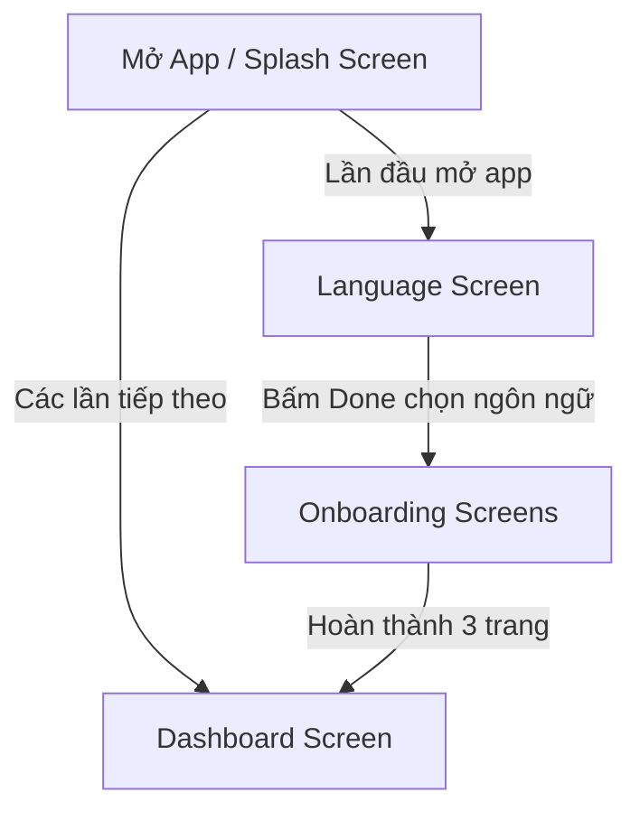

# Hướng dẫn Xử lý Luồng Khởi chạy & Logic Quảng cáo (Splash -> Language -> Onboarding)

Tài liệu này hướng dẫn chi tiết luồng điều hướng khởi chạy ứng dụng (Startup Flow) cùng với việc cấu hình, tải trước (preload) và hiển thị các loại quảng cáo (Interstitial, Native, Fullscreen Native). Đặc biệt bao gồm logic xử lý khi người dùng xem quảng cáo `FSC23` (Native Full Screen 23) từ 3 giây trở lên sẽ quay về màn hình Onboarding đầu tiên.

---

## 1. Luồng Điều Hướng Khởi Chạy (App Startup Flow)

Luồng di chuyển mặc định khi mở ứng dụng lần đầu:


---

## 2. Chi Tiết Từng Màn Hình & Logic Quảng Cáo

### 2.1. Splash Screen
*   **Mục tiêu**: Khởi chạy màn hình chào, hiển thị thanh tiến trình tải (progress bar) và tải trước quảng cáo Interstitial để hiển thị.
*   **Logic Tải Quảng Cáo**:
    *   Sử dụng cơ chế Waterfall để tải quảng cáo Interstitial:
        1.  Cố gắng tải `I_SPLASH_HIGH`.
        2.  Nếu thất bại, tự động chuyển sang tải `I_SPLASH_MEDIUM`.
        3.  Nếu tiếp tục thất bại, tải `I_SPLASH_ALL`.
*   **Logic Hiển Thị & Điều Hướng**:
    *   Thời gian chờ tối đa (timeout) của Splash Screen là **30 giây**.
    *   Nếu tải quảng cáo thành công trước khi hết timeout và ứng dụng đang ở Foreground (`RESUMED`):
        *   Tăng thanh tiến trình lên `100%`.
        *   Hiển thị quảng cáo Interstitial vừa tải được.
        *   Khi quảng cáo được đóng (`onAdClosed`) hoặc hiển thị thất bại (`onShowFailed`), tiến hành điều hướng:
            *   *Nếu là lần đầu mở app*: Đi tới `Language Screen`.
            *   *Nếu là lần tiếp theo*: Đi tới `Dashboard Screen`.
    *   Nếu quá 30 giây (timeout) hoặc tải toàn bộ Waterfall thất bại:
        *   Tự động bỏ qua quảng cáo, tăng thanh tiến trình lên `100%` và điều hướng trực tiếp đến màn hình tiếp theo.

---

### 2.2. Language Screen
*   **Mục tiêu**: Cho phép người dùng lựa chọn ngôn ngữ hiển thị của ứng dụng.
*   **Logic Quảng Cáo**:
    *   Hiển thị một Native Ad ở phía dưới màn hình dạng Waterfall: tải `N_LANGUAGE_MEDIUM`, nếu thất bại sẽ tải `N_LANGUAGE_ALL`.
    *   Khi Native Ad tải thành công, lưu lại ID quảng cáo đã tải làm fallback cho trang Onboarding 1 (OB1).
*   **Logic Điều Hướng (Nút Done)**:
    *   Khi người dùng chọn xong ngôn ngữ và nhấn nút **Done**:
        *   Nếu ở Splash Screen có quảng cáo Interstitial tải thành công muộn (được lưu trong `SplashAdManager.fallbackAdId`), hiển thị quảng cáo Interstitial này trước. Sau khi người dùng đóng quảng cáo, mới tiếp tục điều hướng.
        *   *Nếu mở từ Splash (lần đầu)*: Đi tới `Onboarding Screen`.
        *   *Nếu mở từ Settings (thay đổi ngôn ngữ)*: Quay lại màn hình trước đó (`navController.popBackStack()`).

---

### 2.3. Onboarding Screens (3 Trang)
Sử dụng `HorizontalPager` của Jetpack Compose để quản lý 3 trang Onboarding (OB1, OB2, OB3).

#### A. Cấu Hình Native Ad Cho Từng Trang (Bottom Ad)
*   **Trang 1 (OB1)**:
    *   Ưu tiên hiển thị Native Ad fallback từ màn hình Language nếu có.
    *   Nếu không có, thực hiện tải và hiển thị quảng cáo `N_ONBOARD_1`.
*   **Trang 2 (OB2)**:
    *   Ưu tiên hiển thị Native Ad fallback từ trang OB1 nếu ad tại OB1 tải thành công nhưng chưa được hiển thị.
    *   Nếu không có, thực hiện tải và hiển thị quảng cáo `N_ONBOARD_2`.
    *   *Đồng thời*: Thực hiện **tải trước (preload) quảng cáo Full Screen Native `N_FS_23` (FSC23)** tại trang này để chuẩn bị cho bước chuyển tiếp.
*   **Trang 3 (OB3)**:
    *   Tải và hiển thị Native Ad `N_ONBOARD_3`.

#### B. Logic Chuyển Trang & Hiển Thị Quảng Cáo Full Screen
*   **Chuyển tiếp từ OB1 sang OB2**:
    *   Khi người dùng nhấn "Next" hoặc vuốt sang trang 2:
        *   Nếu đã load được Full Screen Native `N_FS_12` (hoặc `N_FS_12_M`), hiển thị quảng cáo này. Sau khi quảng cáo được đóng, cuộn đến trang 2.
*   **Chuyển tiếp từ OB2 sang OB3 (Quảng cáo FSC23)**:
    *   Khi người dùng nhấn "Next" hoặc vuốt từ trang 2 sang trang 3, hệ thống sẽ cố gắng hiển thị quảng cáo Full Screen Native `N_FS_23` (FSC23).

---

## 3. Logic Đặc Biệt: Xử lý Thời gian Xem Quảng Cáo FSC23

Để tránh việc người dùng bị lạm dụng quảng cáo hoặc tăng tương tác tích cực, ứng dụng áp dụng quy tắc: **Nếu người dùng ở lại xem quảng cáo FSC23 từ 3 giây trở lên, khi đóng quảng cáo họ sẽ bị quay lại màn hình Onboarding đầu tiên (OB1) thay vì tiếp tục đến OB3.**

### Thuật toán thực hiện:
1.  **Ghi nhận thời điểm hiển thị**: Ngay trước khi gọi hàm hiển thị quảng cáo `showNativeFullScreenDialog` cho ID `N_FS_23`, ghi lại mốc thời gian hiện tại:
    ```kotlin
    val showAdTime = System.currentTimeMillis()
    ```
2.  **Đo lường thời gian xem**: Trong callback đóng quảng cáo (`onClose` / `onDismiss`), tính toán khoảng thời gian đã trôi qua:
    ```kotlin
    val duration = System.currentTimeMillis() - showAdTime
    ```
3.  **Xử lý điều hướng tương ứng**:
    *   **Trường hợp 1 (Thời gian xem >= 3 giây)**: Người dùng xem quảng cáo từ `3000ms` trở lên. Thực hiện cuộn ngược pager về trang đầu tiên (Onboard 1, index = `0`):
        ```kotlin
        if (duration >= 3000L) {
            scope.launch { pagerState.animateScrollToPage(0) }
        }
        ```
    *   **Trường hợp 2 (Thời gian xem < 3 giây)**: Người dùng tắt quảng cáo nhanh chóng. Cho phép cuộn tiếp tới trang tiếp theo (Onboard 3, index = `2`):
        ```kotlin
##        else {
            scope.launch { pagerState.animateScrollToPage(nextPage) }
        }
        ```

### Minh họa Code chi tiết trong `OnboardingScreen`:

```kotlin
// Hàm xử lý hiển thị quảng cáo full screen khi nhấn nút Next
fun showFullscreenThenGo(nextPage: Int) {
    val fs12Id = OnboardAdManager.fs12LoadedAdId ?: resolveFs12LoadedId()
    val fullscreenId = when {
        fs12Id != null && !OnboardAdManager.isFs12Shown -> fs12Id
        OnboardAdManager.fs23LoadedAdId != null && !OnboardAdManager.isFs23Shown -> OnboardAdManager.fs23LoadedAdId
        checkNativeLoaded(N_FS_23) && !OnboardAdManager.isFs23Shown -> N_FS_23
        else -> null
    }

    if (activity != null && fullscreenId != null && checkNativeLoaded(fullscreenId)) {
        showLoadingOverlay = true
        Log.d(TAG_ONBOARD_ADS, "Show fullscreen native before page $nextPage: $fullscreenId")
        showLoadingOverlay = false
        
        // 1. Ghi lại thời điểm bắt đầu hiển thị quảng cáo
        val showTime = System.currentTimeMillis()
        
        activity.showNativeFullScreenDialog(fullscreenId) {
            if (fullscreenId == N_FS_12_M || fullscreenId == N_FS_12) {
                OnboardAdManager.isFs12Shown = true
                scope.launch { pagerState.animateScrollToPage(nextPage) }
            } else if (fullscreenId == N_FS_23) {
                OnboardAdManager.isFs23Shown = true
                
                // 2. Tính toán khoảng thời gian xem quảng cáo
                val duration = System.currentTimeMillis() - showTime
                Log.d(TAG_ONBOARD_ADS, "FSC23 Ad watched duration: ${duration}ms")
                
                // 3. Thực hiện logic điều hướng tương ứng
                if (duration >= 3000L) {
                    // Xem >= 3 giây -> Quay lại trang Onboarding 1 (index 0)
                    scope.launch { pagerState.animateScrollToPage(0) }
                } else {
                    // Xem < 3 giây -> Tiếp tục chuyển sang trang tiếp theo
                    scope.launch { pagerState.animateScrollToPage(nextPage) }
                }
            }
        }
    } else {
        scope.launch { pagerState.animateScrollToPage(nextPage) }
    }
}
```

Tương tự, khi người dùng vuốt tay để chuyển trang (`LaunchedEffect(pagerState.currentPage)`):
```kotlin
if (currentPage == 2 && oldPage == 1) {
    val fsId = when {
        OnboardAdManager.fs12LoadedAdId != null && !OnboardAdManager.isFs12Shown -> OnboardAdManager.fs12LoadedAdId
        OnboardAdManager.fs23LoadedAdId != null && !OnboardAdManager.isFs23Shown -> OnboardAdManager.fs23LoadedAdId
        checkNativeLoaded(N_FS_23) && !OnboardAdManager.isFs23Shown -> N_FS_23
        else -> null
    }
    if (activity != null && fsId != null && checkNativeLoaded(fsId)) {
        Log.d(TAG_ONBOARD_ADS, "Show fullscreen after swipe OB2 -> OB3: $fsId")
        
        // Ghi lại thời điểm bắt đầu hiển thị quảng cáo
        val showTime = System.currentTimeMillis()
        
        activity.showNativeFullScreenDialog(fsId) {
            if (fsId == N_FS_12_M || fsId == N_FS_12) {
                OnboardAdManager.isFs12Shown = true
            } else if (fsId == N_FS_23) {
                OnboardAdManager.isFs23Shown = true
                
                // Tính toán thời gian xem
                val duration = System.currentTimeMillis() - showTime
                if (duration >= 3000L) {
                    // Xem >= 3 giây -> Quay ngược lại Onboard 1
                    scope.launch { pagerState.animateScrollToPage(0) }
                }
            }
        }
    }
}
```
