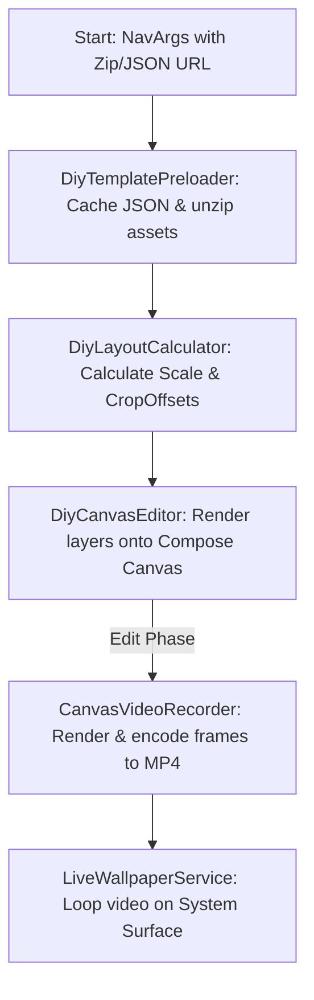

# Android Compose DIY Wallpaper Engine: Complete Integration Blueprint

This document details the complete end-to-end implementation for building a custom DIY Wallpaper Engine in Jetpack Compose. It includes asset preloading, coordinate scaling math, dynamic canvas rendering, frame-by-frame MP4 recording, and Live Wallpaper Service binding.

---

## 1. Pipeline Architecture



---

## 2. Part 1: Pre-processing & Caching System (`DiyTemplatePreloader.kt`)

This utility handles downloading the template configuration (`data.json`) and unzipping the asset bundle (`assets.zip`) into a version-controlled cache directory.

```kotlin
package com.example.wallpaper.preload

import android.content.Context
import com.google.gson.Gson
import okhttp3.OkHttpClient
import okhttp3.Request
import java.io.BufferedInputStream
import java.io.File
import java.io.FileInputStream
import java.io.FileOutputStream
import java.util.zip.ZipInputStream

// 1. Data Models representing the Template JSON structure
data class DiyConfigDto(
    val width: Int,
    val height: Int,
    val background: String?,
    val elements: List<DiyElementDto>
)

data class DiyElementDto(
    val type: String,          // "Text", "Sticker", "Picture", "Image"
    val x: Int,
    val y: Int,
    val width: Int,
    val height: Int,
    val angle: Float?,
    val layoutIndex: Int,
    val srcName: String?,      // File name inside the unzipped cache
    val title: String?,        // For text elements
    val fontSize: Int?,
    val fontColor: String?,
    val fontFamilyIndex: Int?
)

data class PreloadResult(
    val cacheDir: File,
    val config: DiyConfigDto
)

class DiyTemplatePreloader(
    private val context: Context,
    private val okHttpClient: OkHttpClient = OkHttpClient()
) {
    private val gson = Gson()

    /**
     * Preloads the DIY template config and unzips assets into local cache.
     * @param templateId Unique template ID.
     * @param configUrl URL of the template layout JSON.
     * @param zipUrl URL of the assets zip file.
     */
    suspend fun preloadTemplate(templateId: String, configUrl: String, zipUrl: String): PreloadResult {
        val rootCacheDir = File(context.cacheDir, "diy_wallpaper/$templateId").apply { mkdirs() }
        
        // 1. Download/Load data.json
        val configFile = File(rootCacheDir, "data.json")
        val configJson = if (!configFile.exists() || configFile.length() == 0L) {
            val json = httpGetString(configUrl)
            configFile.writeText(json, Charsets.UTF_8)
            json
        } else {
            configFile.readText(Charsets.UTF_8)
        }
        val config = gson.fromJson(configJson, DiyConfigDto::class.java)

        // 2. Download and Unzip asset bundle
        val zipFile = File(rootCacheDir, "assets.zip")
        if (!zipFile.exists() || zipFile.length() == 0L) {
            downloadFile(zipUrl, zipFile)
            unzip(zipFile, rootCacheDir)
            zipFile.delete() // Clean up zip after extraction
        }

        return PreloadResult(rootCacheDir, config)
    }

    private fun httpGetString(url: String): String {
        val request = Request.Builder().url(url).build()
        okHttpClient.newCall(request).execute().use { response ->
            if (!response.isSuccessful) throw IllegalStateException("Failed to load JSON: $url")
            return response.body?.string() ?: throw IllegalStateException("Empty JSON body")
        }
    }

    private fun downloadFile(url: String, outFile: File) {
        val request = Request.Builder().url(url).build()
        okHttpClient.newCall(request).execute().use { response ->
            if (!response.isSuccessful) throw IllegalStateException("Failed to download file: $url")
            val byteStream = response.body?.byteStream() ?: throw IllegalStateException("Empty asset zip")
            FileOutputStream(outFile).use { fileOut ->
                byteStream.copyTo(fileOut)
            }
        }
    }

    private fun unzip(zipFile: File, targetDir: File) {
        ZipInputStream(BufferedInputStream(FileInputStream(zipFile))).use { zipIn ->
            var entry = zipIn.nextEntry
            while (entry != null) {
                val file = File(targetDir, entry.name)
                if (entry.isDirectory) {
                    file.mkdirs()
                } else {
                    file.parentFile?.mkdirs()
                    FileOutputStream(file).use { out ->
                        zipIn.copyTo(out)
                    }
                }
                zipIn.closeEntry()
                entry = zipIn.nextEntry
            }
        }
    }
}
```

---

## 3. Part 2: Coordinate Translation Math (`DiyLayoutCalculator.kt`)

This component calculates the scaling factor and offset adjustments necessary to center-crop/fit the template design space onto the device screen canvas.

```kotlin
package com.example.wallpaper.calculator

import kotlin.math.max

data class CanvasMetrics(
    val scaleFactor: Float,
    val offsetX: Float,
    val offsetY: Float
)

object DiyLayoutCalculator {
    /**
     * Computes the scale and offsets to map the design coordinate space into screen space.
     * @param screenWidth Width of the device screen canvas.
     * @param screenHeight Height of the device screen canvas.
     * @param designWidth Template design width (e.g., 1080).
     * @param designHeight Template design height (e.g., 1920).
     */
    fun calculateMetrics(
        screenWidth: Int,
        screenHeight: Int,
        designWidth: Int,
        designHeight: Int
    ): CanvasMetrics {
        if (screenWidth <= 0 || screenHeight <= 0 || designWidth <= 0 || designHeight <= 0) {
            return CanvasMetrics(1.0f, 0.0f, 0.0f)
        }

        // 1. Calculate the max scaling factor (equivalent to center-crop behavior)
        val scaleFactor = max(
            screenWidth.toFloat() / designWidth.toFloat(),
            screenHeight.toFloat() / designHeight.toFloat()
        )

        // 2. Compute translation offsets to center the design space on the screen
        val offsetX = (screenWidth - designWidth * scaleFactor) / 2.0f
        val offsetY = (screenHeight - designHeight * scaleFactor) / 2.0f

        return CanvasMetrics(scaleFactor, offsetX, offsetY)
    }
}
```

---

## 4. Part 3: Jetpack Compose Canvas Editor (`DiyCanvasEditor.kt`)

This Composable compiles background resources and stickers/texts using translated screen coordinates, drawing them on a Jetpack Compose `Canvas`.

```kotlin
package com.example.wallpaper.ui

import android.graphics.BitmapFactory
import android.graphics.Color
import android.graphics.Typeface
import androidx.compose.foundation.Canvas
import androidx.compose.foundation.layout.fillMaxSize
import androidx.compose.runtime.Composable
import androidx.compose.runtime.remember
import androidx.compose.ui.Modifier
import androidx.compose.ui.geometry.Offset
import androidx.compose.ui.graphics.asImageBitmap
import androidx.compose.ui.graphics.drawscope.drawIntoCanvas
import androidx.compose.ui.graphics.drawscope.rotate
import androidx.compose.ui.graphics.nativeCanvas
import androidx.compose.ui.platform.LocalContext
import androidx.compose.ui.unit.IntSize
import com.example.wallpaper.calculator.DiyLayoutCalculator
import com.example.wallpaper.preload.DiyConfigDto
import java.io.File

@Composable
fun DiyCanvasEditor(
    config: DiyConfigDto,
    cacheDir: File,
    screenWidth: Int,
    screenHeight: Int,
    modifier: Modifier = Modifier
) {
    val context = LocalContext.current
    
    // 1. Compute scale metrics based on sizes
    val metrics = remember(screenWidth, screenHeight, config) {
        DiyLayoutCalculator.calculateMetrics(
            screenWidth = screenWidth,
            screenHeight = screenHeight,
            designWidth = config.width,
            designHeight = config.height
        )
    }

    // 2. Decode background bitmap from cache directory
    val bgBitmap = remember(config.background, cacheDir) {
        config.background?.let { bgPath ->
            val bgFile = File(cacheDir, bgPath)
            if (bgFile.exists()) BitmapFactory.decodeFile(bgFile.absolutePath) else null
        }
    }

    Canvas(modifier = modifier.fillMaxSize()) {
        val canvasWidth = size.width.toInt()
        val canvasHeight = size.height.toInt()

        // Draw background cropped/centered
        bgBitmap?.let { bmp ->
            drawImage(
                image = bmp.asImageBitmap(),
                dstSize = IntSize(canvasWidth, canvasHeight)
            )
        }

        // 3. Render element layers
        config.elements
            .sortedBy { it.layoutIndex } // Draw elements sorted by z-index
            .forEach { element ->
                // Map coordinates using calculation metrics
                val xScreen = (element.x * metrics.scaleFactor) + metrics.offsetX
                val yScreen = (element.y * metrics.scaleFactor) + metrics.offsetY
                val wScreen = element.width * metrics.scaleFactor
                val hScreen = element.height * metrics.scaleFactor

                rotate(
                    degrees = element.angle ?: 0.0f,
                    pivot = Offset(xScreen + wScreen / 2f, yScreen + hScreen / 2f)
                ) {
                    if (element.type == "Text") {
                        // Render Text Elements using native Canvas
                        drawIntoCanvas { canvas ->
                            val textPaint = android.text.TextPaint().apply {
                                color = element.fontColor?.let { Color.parseColor(it) } ?: Color.BLACK
                                textSize = ((element.fontSize ?: 50) * metrics.scaleFactor) / 2f
                                typeface = Typeface.DEFAULT
                                isAntiAlias = true
                            }
                            canvas.nativeCanvas.drawText(
                                element.title ?: "",
                                xScreen,
                                yScreen + textPaint.textSize, // Adjust vertical bias
                                textPaint
                            )
                        }
                    } else if (element.srcName != null) {
                        // Render Sticker / Image Elements
                        val imageFile = File(cacheDir, element.srcName)
                        if (imageFile.exists()) {
                            val bitmap = BitmapFactory.decodeFile(imageFile.absolutePath)
                            bitmap?.let {
                                drawImage(
                                    image = it.asImageBitmap(),
                                    dstOffset = androidx.compose.ui.unit.IntOffset(xScreen.toInt(), yScreen.toInt()),
                                    dstSize = IntSize(wScreen.toInt(), hScreen.toInt())
                                )
                            }
                        }
                    }
                }
            }
    }
}
```

---

## 5. Part 4: Canvas Video Recorder (`CanvasVideoRecorder.kt`)

Use this helper to encode Compose Canvas drawings frame-by-frame into a compressed `.mp4` video.

```kotlin
package com.example.wallpaper.recorder

import android.graphics.Canvas
import android.media.MediaCodec
import android.media.MediaCodecInfo
import android.media.MediaFormat
import android.media.MediaMuxer
import android.view.Surface
import java.io.File

class CanvasVideoRecorder(
    private val width: Int,
    private val height: Int,
    private val outputFile: File
) {
    private var mediaCodec: MediaCodec? = null
    private var mediaMuxer: MediaMuxer? = null
    private var inputSurface: Surface? = null
    private var trackIndex = -1
    private var isMuxerStarted = false
    private val bufferInfo = MediaCodec.BufferInfo()

    init {
        setupEncoder()
    }

    private fun setupEncoder() {
        val mimeType = MediaFormat.MIMETYPE_VIDEO_AVC
        val format = MediaFormat.createVideoFormat(mimeType, width, height).apply {
            setInteger(MediaFormat.KEY_COLOR_FORMAT, MediaCodecInfo.CodecCapabilities.COLOR_FormatSurface)
            setInteger(MediaFormat.KEY_BIT_RATE, 3000000)
            setInteger(MediaFormat.KEY_FRAME_RATE, 30)
            setInteger(MediaFormat.KEY_I_FRAME_INTERVAL, 1)
        }

        mediaCodec = MediaCodec.createEncoderByType(mimeType).apply {
            configure(format, null, null, MediaCodec.CONFIGURE_FLAG_ENCODE)
            inputSurface = createInputSurface()
            start()
        }

        mediaMuxer = MediaMuxer(outputFile.absolutePath, MediaMuxer.OutputFormat.MUXER_OUTPUT_MPEG_4)
    }

    fun recordFrame(presentationTimeNs: Long, drawBlock: (Canvas) -> Unit) {
        val surface = inputSurface ?: return
        val canvas = if (android.os.Build.VERSION.SDK_INT >= android.os.Build.VERSION_CODES.M) {
            surface.lockHardwareCanvas()
        } else {
            surface.lockCanvas(null)
        }
        
        try {
            drawBlock(canvas)
        } finally {
            surface.unlockCanvasAndPost(canvas)
        }

        drainEncoder(false)
    }

    private fun drainEncoder(endOfStream: Boolean) {
        val codec = mediaCodec ?: return
        val muxer = mediaMuxer ?: return

        if (endOfStream) {
            codec.signalEndOfInputStream()
        }

        while (true) {
            val outputBufferIndex = codec.dequeueOutputBuffer(bufferInfo, 10000)
            if (outputBufferIndex == MediaCodec.INFO_TRY_AGAIN_LATER) {
                if (!endOfStream) break
            } else if (outputBufferIndex == MediaCodec.INFO_OUTPUT_FORMAT_CHANGED) {
                if (isMuxerStarted) throw IllegalStateException("Format changed twice")
                trackIndex = muxer.addTrack(codec.outputFormat)
                muxer.start()
                isMuxerStarted = true
            } else if (outputBufferIndex >= 0) {
                val encodedData = codec.getOutputBuffer(outputBufferIndex) ?: continue
                if (bufferInfo.size != 0) {
                    encodedData.position(bufferInfo.offset)
                    encodedData.limit(bufferInfo.offset + bufferInfo.size)
                    muxer.writeSampleData(trackIndex, encodedData, bufferInfo)
                }
                codec.releaseOutputBuffer(outputBufferIndex, false)
                if (bufferInfo.flags and MediaCodec.BUFFER_FLAG_END_OF_STREAM != 0) break
            }
        }
    }

    fun release() {
        try {
            drainEncoder(true)
            mediaCodec?.stop()
        } finally {
            mediaCodec?.release()
            mediaCodec = null
            if (isMuxerStarted) mediaMuxer?.stop()
            mediaMuxer?.release()
            mediaMuxer = null
            inputSurface?.release()
            inputSurface = null
        }
    }
}
```

---

## 6. Part 5: Live Wallpaper Service (`LiveWallpaperService.kt`)

The background service binding the video file loop to the system wallpaper Surface.

### A. Manifest Declaration (`AndroidManifest.xml`)
```xml
<service
    android:name=".LiveWallpaperService"
    android:label="DIY Live Wallpaper"
    android:permission="android.permission.BIND_WALLPAPER"
    android:exported="true">
    <intent-filter>
        <action android:name="android.service.wallpaper.WallpaperService" />
    </intent-filter>
    <meta-data
        android:name="android.service.wallpaper"
        android:resource="@xml/live_wallpaper" />
</service>
```

### B. Service Class
```kotlin
package com.example.wallpaper

import android.service.wallpaper.WallpaperService
import android.view.SurfaceHolder
import android.media.MediaPlayer
import android.content.Context

class LiveWallpaperService : WallpaperService() {
    override fun onCreateEngine(): Engine = VideoWallpaperEngine()

    inner class VideoWallpaperEngine : Engine(), SurfaceHolder.Callback {
        private var mediaPlayer: MediaPlayer? = null
        private var mSurfaceHolder: SurfaceHolder? = null
        private var isVisible = false
        private var hasSurface = false

        override fun onCreate(surfaceHolder: SurfaceHolder) {
            super.onCreate(surfaceHolder)
            mSurfaceHolder = surfaceHolder
            surfaceHolder.addCallback(this)
        }

        override fun onDestroy() {
            releasePlayer()
            mSurfaceHolder?.removeCallback(this)
            super.onDestroy()
        }

        override fun onVisibilityChanged(visible: Boolean) {
            isVisible = visible
            if (visible) startPlayback() else pausePlayback()
        }

        override fun surfaceCreated(holder: SurfaceHolder) {
            hasSurface = true
            if (isVisible) startPlayback()
        }

        override fun surfaceChanged(holder: SurfaceHolder, format: Int, width: Int, height: Int) {}

        override fun surfaceDestroyed(holder: SurfaceHolder) {
            hasSurface = false
            pausePlayback()
        }

        private fun startPlayback() {
            val holder = mSurfaceHolder ?: return
            if (!hasSurface) return
            val videoPath = getPersistedWallpaperPath() ?: return

            try {
                if (mediaPlayer == null) {
                    mediaPlayer = MediaPlayer().apply {
                        setDataSource(videoPath)
                        setSurface(holder.surface)
                        isLooping = true
                        prepare()
                    }
                }
                mediaPlayer?.start()
            } catch (e: Exception) {
                e.printStackTrace()
            }
        }

        private fun pausePlayback() {
            try { mediaPlayer?.pause() } catch (e: Exception) {}
        }

        private fun releasePlayer() {
            mediaPlayer?.release()
            mediaPlayer = null
        }

        private fun getPersistedWallpaperPath(): String? {
            return applicationContext.getSharedPreferences("wallpaper_prefs", Context.MODE_PRIVATE)
                .getString("active_live_wallpaper_path", null)
        }
    }
}
```

---

## 7. Part 6: Launcher & Integration in Compose

Save the video path and trigger the OS wallpaper picker.

```kotlin
package com.example.wallpaper.ui

import android.app.WallpaperManager
import android.content.ComponentName
import android.content.Context
import android.content.Intent
import androidx.compose.material3.Button
import androidx.compose.material3.Text
import androidx.compose.runtime.Composable
import androidx.compose.ui.platform.LocalContext
import com.example.wallpaper.LiveWallpaperService

@Composable
fun ApplyLiveWallpaperButton(videoPath: String) {
    val context = LocalContext.current
    Button(onClick = {
        context.getSharedPreferences("wallpaper_prefs", Context.MODE_PRIVATE)
            .edit()
            .putString("active_live_wallpaper_path", videoPath)
            .apply()
            
        val intent = Intent(WallpaperManager.ACTION_CHANGE_LIVE_WALLPAPER).apply {
            putExtra(
                WallpaperManager.EXTRA_LIVE_WALLPAPER_COMPONENT,
                ComponentName(context, LiveWallpaperService::class.java)
            )
            addFlags(Intent.FLAG_ACTIVITY_NEW_TASK)
        }
        context.startActivity(intent)
    }) {
        Text("Apply Live Wallpaper")
    }
}
```
